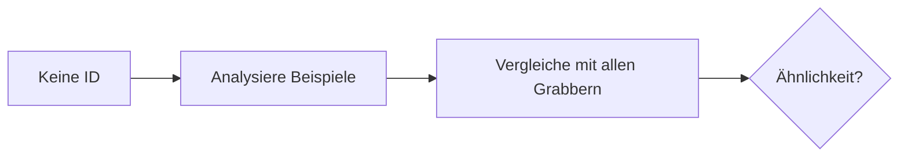

# 🧲 Semantic Grabber Flow - Detaillierte Erklärung

## Übersicht

Der Semantic Grabber Flow stellt sicher, dass **JEDER Marker** eine `semantische_grabber_id` hat. Dies ist ein Pflichtfeld nach dem Projekt-Standard.

## 🔄 Automatischer Ablauf

### 1. **Marker wird erstellt/importiert**
   - User erstellt neuen Marker (Formular, YAML oder Python)
   - System prüft: Hat der Marker eine `semantische_grabber_id`?

### 2. **Wenn KEINE Grabber-ID vorhanden:**



#### Ähnlichkeitsanalyse:
- System vergleicht die Beispiele des neuen Markers mit allen existierenden Grabbern
- Berechnet Ähnlichkeitswert (0.0 - 1.0)

#### Entscheidungslogik:

| Ähnlichkeit | Aktion | Beispiel |
|-------------|---------|----------|
| ≥ 85% | **Merge-Vorschlag** | "Fast identisch zu TRUST_EROSION_SEM - Merge empfohlen" |
| ≥ 72% | **Verwende existierenden** | "Verwendet TRUST_EROSION_SEM (78% ähnlich)" |
| < 72% | **Erstelle neuen** | "Neuer Grabber AUTO_SEM_20240120_A1B2 erstellt" |

### 3. **Grabber-Erstellung**

Wenn ein neuer Grabber erstellt wird:

```yaml
AUTO_SEM_20240120_A1B2:
  beschreibung: "Automatisch erkannt aus MARKER_NAME"
  patterns:
    - "Beispiel 1 aus dem Marker"
    - "Beispiel 2 aus dem Marker"
    - "..." # Max 10 Patterns
  created_from: "MARKER_NAME"
  created_at: "2024-01-20T10:00:00"
```

### 4. **Speicherung**
- Grabber wird in `semantic_grabber_library.yaml` gespeichert
- Marker erhält die Grabber-ID
- Beide sind nun verknüpft

## 📝 Beispiel-Ablauf

### Input: Neuer Marker ohne ID
```yaml
marker: FINANCIAL_PRESSURE
beschreibung: "Finanzieller Druck"
beispiele:
  - "Ich brauche dringend Geld"
  - "Kannst du mir 500€ leihen?"
```

### Prozess:
1. System erkennt: Keine `semantische_grabber_id`
2. Analysiert Beispiele
3. Findet keine ähnlichen Grabber (< 72%)
4. Erstellt neuen Grabber: `AUTO_SEM_20240120_F3D4`

### Output: Marker mit Grabber
```yaml
marker_name: FINANCIAL_PRESSURE_MARKER
beschreibung: >
  Finanzieller Druck
beispiele:
  - "Ich brauche dringend Geld"
  - "Kannst du mir 500€ leihen?"
semantische_grabber_id: AUTO_SEM_20240120_F3D4  # ← Automatisch hinzugefügt!

metadata:
  created_at: 2024-01-20T10:00:00
  created_by: FRAUSAR_GUI_v2
```

## 🔀 Multi-Marker Import

Der verbesserte Parser erkennt verschiedene Formate:

### Format 1: Mit Trennzeichen
```yaml
marker: MARKER1
beschreibung: "..."
beispiele: [...]
---
marker: MARKER2
beschreibung: "..."
beispiele: [...]
```

### Format 2: Als Liste
```yaml
- marker: MARKER1
  beschreibung: "..."
  beispiele: [...]
- marker: MARKER2
  beschreibung: "..."
  beispiele: [...]
```

### Format 3: Minimales Format (User-Beispiel)
```yaml
marker: URGENCY_PRESSURE
beschreibung: Zeitdruck
beispiele:
  - "Beispiel 1"

- marker: VICTIM_PLAYING
  beschreibung: Opferrolle
  beispiele:
    - "Beispiel 1"
```

## 🎯 Vorteile

1. **Keine verwaisten Marker**: Jeder Marker hat garantiert einen Grabber
2. **Automatische Deduplizierung**: Ähnliche Marker teilen sich Grabber
3. **Skalierbarkeit**: System wächst intelligent mit
4. **Konsistenz**: Einheitliche Struktur für alle Marker

## 🛠️ Manuelle Kontrolle

### Grabber analysieren:
```bash
# GUI: Button "🧲 Grabber analysieren"
# Zeigt Überschneidungen und Statistiken
```

### Grabber optimieren:
```bash
# GUI: Button "🔄 Grabber optimieren"
# Führt ähnliche Grabber zusammen
```

## 📊 Metriken

Das System trackt:
- Anzahl Grabber gesamt
- Verwendung pro Grabber
- Überschneidungen zwischen Grabbern
- Grabber ohne Marker (ungenutzt)

## 🚨 Wichtige Hinweise

1. **Grabber-IDs sind unveränderlich** - einmal erstellt, bleiben sie bestehen
2. **Patterns sind Kernaussagen** - nicht wörtlich identisch mit Marker-Beispielen
3. **Merge-Vorschläge** erfordern User-Bestätigung
4. **Auto-IDs** folgen dem Format `AUTO_SEM_YYYYMMDD_XXXX`

---

Version: 1.0  
Stand: Januar 2024  
Teil des Semantic Marker Framework 