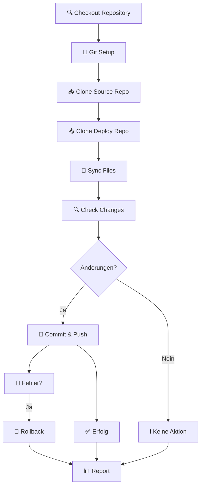

# 🚀 Automatisierte Repository-Synchronisation

Dieses Repository enthält einen automatisierten Workflow zur Synchronisation von Änderungen zwischen Development- und Deploy-Repositories.

## 🎯 Überblick

Der Auto-Sync Workflow synchronisiert automatisch Änderungen vom Development-Repository `_1-_MEWT-backend` zum Deploy-Repository `ME_CORE_Backend-mar-spar`.

### Vorteile gegenüber dem ursprünglichen Bash-Script:

✅ **Sichere Authentifizierung** mit GitHub Tokens  
✅ **Fehlerbehandlung** und automatisches Rollback  
✅ **Bedingte Synchronisation** (nur bei tatsächlichen Änderungen)  
✅ **Multiple Trigger-Optionen** (Push, Schedule, Manual)  
✅ **Detailliertes Logging** und Status-Reports  
✅ **Konfigurierbare Optionen** über Workflow-Inputs  
✅ **Ausschlusslisten** für verschiedene Dateitypen  

## 🔧 Konfiguration

### Repository-Einstellungen

Die Workflow-Konfiguration erfolgt über Environment-Variablen in der Datei `.github/workflows/sync-to-deploy.yml`:

```yaml
env:
  SOURCE_REPO: 'DYAI2025/_1-_MEWT-backend'      # Quell-Repository
  DEPLOY_REPO: 'DYAI2025/ME_CORE_Backend-mar-spar'  # Ziel-Repository
  DEPLOY_BRANCH: 'main'                          # Ziel-Branch
```

### Ausgeschlossene Dateien und Ordner

Der Workflow schließt automatisch folgende Dateien/Ordner aus:
- `.git`, `.github` (Git-Metadaten)
- `node_modules` (Node.js Dependencies)
- `.env*` (Environment-Dateien)
- `*.log` (Log-Dateien)
- `.DS_Store`, `Thumbs.db` (OS-Dateien)
- `.vscode`, `.idea` (IDE-Konfigurationen)
- `__pycache__`, `*.pyc` (Python Cache)
- `dist`, `build` (Build-Artefakte)

## 🚀 Verwendung

### Automatische Trigger

1. **Bei Push auf main Branch**: Workflow startet automatisch bei jedem Push
2. **Geplant**: Täglich um 02:00 UTC
3. **Manuell**: Über GitHub Actions Interface

### Manuelle Ausführung

1. Gehe zu **Actions** → **Auto-Sync to Deploy Repository**
2. Klicke auf **Run workflow**
3. Optionale Parameter:
   - **Force sync**: Sync erzwingen, auch ohne Änderungen
   - **Source branch**: Alternativer Quell-Branch (Standard: main)

### Workflow-Schritte



## 📊 Monitoring und Logs

### Status-Reports

Jeder Workflow-Lauf erstellt einen detaillierten Summary-Report mit:
- Quell- und Ziel-Repository Information
- Commit-Hashes und Änderungen
- Trigger-Typ und Zeitstempel
- Erfolgs-/Fehlerstatus

### Fehlerbehandlung

Bei Fehlern während der Synchronisation:
1. **Automatisches Rollback** zum vorherigen Zustand
2. **Detaillierte Fehlermeldungen** in den Logs
3. **Backup-Erstellung** vor Änderungen

### Logs einsehen

1. Gehe zu **Actions** → **Auto-Sync to Deploy Repository**
2. Wähle einen Workflow-Lauf aus
3. Erweitere die einzelnen Schritte für Details

## 🔐 Sicherheit

### Berechtigungen

Der Workflow benötigt folgende Berechtigungen:
- **Repository Access**: Lesen des Quell-Repositories
- **Write Access**: Schreiben in das Deploy-Repository
- **Actions**: Standard GitHub Actions Token

### Token-Konfiguration

Standardmäßig wird `GITHUB_TOKEN` verwendet. Für erweiterte Berechtigungen kann ein **Personal Access Token** konfiguriert werden:

1. Erstelle ein PAT mit Repository-Berechtigungen
2. Füge es als Secret hinzu: `Settings` → `Secrets` → `DEPLOY_TOKEN`
3. Aktualisiere die Workflow-Datei:
   ```yaml
   token: ${{ secrets.DEPLOY_TOKEN }}
   ```

## 🛠️ Anpassungen

### Ausschlusslisten erweitern

Bearbeite den `rsync`-Befehl in der Workflow-Datei:

```yaml
rsync -av --delete \
  --exclude='deine-datei' \
  --exclude='dein-ordner' \
  source-repo/ deploy-repo/
```

### Zusätzliche Trigger

Füge weitere Trigger in der `on:`-Sektion hinzu:

```yaml
on:
  push:
    branches: [ main, develop ]  # Mehrere Branches
  pull_request:
    types: [closed]              # Bei geschlossenen PRs
```

### Verschiedene Sync-Strategien

Der Workflow kann für verschiedene Szenarien angepasst werden:

#### Selective Sync (nur bestimmte Ordner)
```bash
rsync -av --delete \
  --include='src/' \
  --include='config/' \
  --exclude='*' \
  source-repo/ deploy-repo/
```

#### Merge-basierte Synchronisation
```bash
# Statt rsync: Git-merge verwenden
git merge origin/source-branch
```

## 📞 Support

Bei Problemen:
1. Prüfe die **Action-Logs** für detaillierte Fehlermeldungen
2. Verifiziere die **Repository-Berechtigungen**
3. Kontrolliere die **Ausschlusslisten**

### Häufige Probleme

**Problem**: "Permission denied"
**Lösung**: PAT mit ausreichenden Berechtigungen konfigurieren

**Problem**: "No changes detected" obwohl Änderungen vorhanden
**Lösung**: Ausschlusslisten prüfen, evt. `force_sync` verwenden

**Problem**: Merge-Konflikte
**Lösung**: Manueller Eingriff erforderlich, da automatisches Merging nicht implementiert